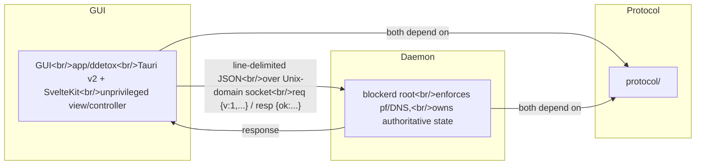

# app_blocker

A distraction blocker split into a **privileged daemon** (the source of truth that
enforces blocking) and an **unprivileged desktop GUI** (a thin view/controller).

<sub>If diagram is missing, see source or open in a Markdown viewer with Mermaid support.</sub>
<!-- end mermaid -->

The **daemon is the source of truth.** The GUI never enforces anything and never
trusts its own optimistic state — it re-fetches `get_status` after every change.
The committed-session lock (no early stop / no un-blocking once committed) is
enforced **daemon-side**; the GUI only disables those controls for honesty.

The wire protocol mirrors the real daemon (`dp_course`), not the original brief:
`GetStatus` returns blocklist **counts** (not the entries), and the daemon's own
committed-session command is not implemented yet. The in-repo `blockerd` extends
that surface with `GetStats` and a `block_page` status flag (see below). See
[Wire protocol](#wire-protocol).

## Features

- **Domain & address blocking** with three domain match modes:
  `example.com` (host + all subdomains), `*.example.com` (subdomains only),
  `=example.com` (exact host only). Addresses are blocked by CIDR.
- **DNS sinkhole** (`blockerd`, root): blocked names are intercepted; everything
  else is forwarded to the real upstream resolvers.
- **Custom block page**: blocked `A`/`AAAA` queries resolve to loopback and a
  small built-in HTTP server serves a styled "site blocked" page (HTTP only;
  falls back to NXDOMAIN if it can't bind `:80`).
- **Statistics** (`/stats`): total blocked queries, top blocked entries, and a
  recent-activity feed (`GetStats`, tracked in-memory by the daemon).
- **Website library & scheduled sessions** (see below) with a `/calendar` view.
- **Menu-bar item**: a macOS tray icon (Show / Statistics / Reconcile / Quit);
  closing the window hides it so the scheduler keeps running.

## Website library & scheduled sessions

On top of the manual blocklist, the app owns two **local** features (the daemon
never sees their config):

- **Library** (`/library`) — reusable "site" items, each a label plus domains
  (any of the three match modes: `example.com`, `*.example.com`, `=example.com`)
  and optional CIDRs.
- **Sessions** (`/sessions`) — named groups of library items with a **schedule**:
  one or more rules, each a recurrence (every day · specific weekdays · a
  day-of-month range like the 1st–10th · every-N-days · a fixed date range) and
  optional daily time windows. The `/calendar` view paints active windows per week.

An **app-orchestrated scheduler** (a tokio loop in the Tauri backend, `scheduler.rs`)
ticks ~every 30s and on every config change: it unions the items of the sessions
active *now* and reconciles that against the daemon by pushing only the delta via
the existing `Add*/Remove*` commands. The session-managed set is tracked
separately (`managed.json`) so it never disturbs manually-added blocklist entries.

Two deliberate properties: schedules apply **while the app runs** (the chosen
trade-off), and because the daemon doesn't enforce yet, the scheduler drives the
daemon's *blocklist* (visible via counts) — real network blocking arrives with the
daemon's pf/DNS milestone. The model + recurrence engine live in the shared
`protocol` crate (`config` + `schedule`) so they can migrate into the daemon later.

## Layout

| Path          | What it is                                                                                  |
| ------------- | ------------------------------------------------------------------------------------------- |
| `protocol/`   | Shared types: wire protocol (`Request`, `Reply`, `Status`, `Envelope`) **and** the app config model + recurrence engine (`config`, `schedule`). Both sides depend on it so nothing drifts. |
| `app/ddetox/` | The GUI: Tauri v2 (Rust) backend (IPC client, config store, scheduler, tray) + SvelteKit frontend (Status / Statistics / Library / Sessions / Calendar). |
| `daemon/`     | **`blockerd`** — the daemon used for development. Owns authoritative state (SQLite-backed) and, when run as root, enforces domain blocking via a DNS sinkhole + serves the block page. Mirrors the real `dp_course` protocol and extends it with `GetStats` + `block_page`; CIDR/`pf` enforcement and sessions are still pending. |

## Wire protocol

Line-delimited JSON over a Unix socket. **Requests** carry a protocol version `v`
and a `cmd` tag. **Responses** are `{"ok":true,"data":...}` or `{"ok":false,"error":...}`.

```jsonc
// GUI -> daemon
{"v":1,"cmd":"GetStatus"}
{"v":1,"cmd":"GetStats"}
{"v":1,"cmd":"AddDomains","domains":["*.reddit.com","=old.reddit.com"]}

// daemon -> GUI
// GetStatus: counts + metadata (NOT the blocklist entries; there is no list endpoint).
// `block_page` is true when blocked names resolve to the loopback block page.
{"ok":true,"data":{"daemon_version":"0.1.0","protocol_version":1,"pid":90830,"privileged":true,"blocked_domains":5,"blocked_cidrs":0,"block_page":true,"session":null}}
// GetStats: blocking activity since the daemon started (resets on restart)
{"ok":true,"data":{"since_unix":1782700000,"total_blocked":42,"unique_domains":3,"top":[{"entry":"*.reddit.com","count":30}],"recent":[{"name":"i.redd.it","unix":1782700123}]}}
// Add/Remove: how many changed + the new total
{"ok":true,"data":{"changed":1,"total":6}}
// A rejection, surfaced verbatim in the UI
{"ok":false,"error":"command 'StartSession' is not implemented in this build"}
```

The socket path is `BLOCKERD_SOCKET` if set, otherwise
`/var/run/com.aslonkhamidov.blockerd.sock` (see `protocol::socket_path`). Note the
real daemon currently binds this socket `0o600` (root-only); reaching it from the
unprivileged GUI is a documented daemon-side milestone.

## Develop

The GUI needs a daemon to talk to. For development, run `blockerd` on a dev socket
and point the GUI at the same path:

```sh
# Terminal 1 — the daemon on a writable dev socket/db (no root: IPC only, DNS skipped)
cd daemon
BLOCKERD_SOCKET=/tmp/blockerd-dev.sock BLOCKERD_STATE=/tmp/blockerd-dev.db cargo run

# Terminal 2 — the GUI (Tauri dev: launches Vite + the native window)
cd app/ddetox
BLOCKERD_SOCKET=/tmp/blockerd-dev.sock bun run tauri dev
```

Run without root and the daemon is **IPC-only**: add/remove and counts work, but
the DNS sinkhole, block page, and statistics need `:53`/`:80`, so run it with
`sudo` to exercise those (see `daemon/README.md`). With no daemon running at all,
the GUI shows a "Daemon offline — retrying…" banner and keeps reconnecting with
backoff — that is the expected behavior, not a crash.

### Checks

```sh
cd protocol  && cargo test        # protocol round-trips + version guard
cd daemon    && cargo test        # daemon unit tests + privilege-free IPC smoke test
cd app/ddetox && bun run check    # svelte-check (types)
cd app/ddetox && bun run build    # static export to app/ddetox/build/
```

The daemon also ships an end-to-end socket smoke test (`daemon/scripts/smoke_test.sh`)
that starts it on a temp socket, sends a few requests, and tears down.

## Build & sign (macOS)

```sh
cd app/ddetox
bun run tauri build               # builds frontend + Rust release, then bundles
```

Code signing / notarization credentials come from the environment, never the
repo. Set these before `tauri build` for a Developer-ID build:

```sh
export APPLE_SIGNING_IDENTITY="Developer ID Application: Your Name (TEAMID)"
export APPLE_ID="you@example.com"
export APPLE_PASSWORD="app-specific-password"   # or APPLE_API_KEY/APPLE_API_ISSUER
export APPLE_TEAM_ID="TEAMID"
```

`src-tauri/tauri.conf.json` sets `bundle.macOS.signingIdentity: null` so the
identity is taken from `APPLE_SIGNING_IDENTITY` (or ad-hoc if unset). Tighten the
WebView CSP (`app.security.csp`) before shipping a production build.
